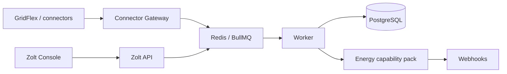

# Zolt AI

Zolt AI is an advisory-only industrial intelligence platform. It ingests telemetry, analyses plant behaviour, and produces explainable recommendations. It does not control hardware.



## What is in this repository

- Canonical telemetry and recommendation contracts
- Tenant-scoped hashed API credentials, RBAC, and fail-closed authentication
- GridFlex connector 1.0 with simulated-versus-live markers
- Energy capability pack (health, curtailment, inverter, battery, forecast advisories)
- API, connector gateway, worker, and Zolt Console
- Advisory-only safety policy that is hard-coded off for physical execution

## Development setup

Requirements: Node.js 22, pnpm 10 (`corepack enable`), Docker Desktop for Postgres and Redis.

```bash
corepack enable
corepack pnpm install
copy .env.example .env
docker compose up -d
corepack pnpm db:generate
corepack pnpm db:deploy
corepack pnpm db:seed
corepack pnpm typecheck
corepack pnpm test
corepack pnpm dev:api
corepack pnpm dev:gateway
corepack pnpm dev:worker
corepack pnpm dev:console
```

Console: `http://localhost:4002`
API: `http://localhost:4000`
Gateway: `http://localhost:4001`

Development seed admin: `admin@zolt.local` / `ChangeMeNow!23`. Production seeding rejects these defaults.

## Production deployment

1. Provision managed PostgreSQL, Redis, and a secrets manager.
2. Set `NODE_ENV=production`, `ZOLT_ADVISORY_ONLY=true`, `ZOLT_TLS_TERMINATED=true`.
3. Do not set `ZOLT_ALLOW_INSECURE_AUTH`.
4. Keep `ZOLT_API_KEY` unset. Inject `ZOLT_SEED_API_KEY` and `ZOLT_SEED_HMAC_SECRET` only for the one-time database seed, then remove and rotate them.
5. Deploy API, gateway, worker, and console images with immutable tags.
6. Run `pnpm db:deploy` then `pnpm db:seed` once per environment.
7. Put TLS termination and trusted proxies in front of the API.

See `docs/DEPLOYMENT.md`.

## Security model

- HMAC signatures are verified before replay keys are claimed.
- API credentials are hashed, tenant-bound, optionally product/installation scoped, expirable, revocable, and rotatable.
- Production authentication is fail-closed. Insecure auth cannot be enabled in production.
- Tenant IDs in requests must match the authenticated credential.
- Hardware execution is hard-coded off.

See `SECURITY.md` and `docs/TENANCY.md`.

## API examples

Ingest via gateway:

```bash
curl -X POST http://localhost:4001/v1/ingest/gridflex \
  -H "content-type: application/json" \
  -H "x-zolt-api-key: $ZOLT_API_KEY" \
  -H "x-zolt-tenant-id: tenant-demo" \
  -H "x-zolt-product-id: product-demo" \
  -H "x-zolt-installation-id: installation-demo" \
  -H "x-zolt-signature-ts: $TS" \
  -H "x-zolt-replay-key: $REPLAY" \
  -H "x-zolt-signature: $SIG" \
  -d "{\"messageId\":\"msg-1\",\"nodeId\":\"inv-1\",\"timestamp\":\"2026-08-12T10:00:00.000Z\",\"readings\":{\"powerKw\":120}}"
```

Analyse:

```bash
curl -X POST http://localhost:4000/v1/analysis \
  -H "content-type: application/json" \
  -H "x-zolt-api-key: $ZOLT_API_KEY" \
  -d "{\"tenantId\":\"tenant-demo\",\"productId\":\"product-demo\",\"installationId\":\"installation-demo\",\"configuration\":{\"exportLimitKw\":100,\"forecastPowerKw\":150}}"
```

## GridFlex integration

The GridFlex connector maps inverter readings onto canonical telemetry schema 1.1, including firmware, vendor/model, Modbus quality, communication health, and `simulated: true` when the payload is not live plant data.

## Troubleshooting

- `AUTH_NOT_CONFIGURED` / `503`: set credentials or seed the database.
- `TENANT_MISMATCH` / `403`: the credential is bound to a different tenant, product, or installation.
- `REPLAY_DETECTED` / `409`: reuse of an ingest replay key.
- `INSTALLATION_IDENTITY_NOT_FOUND`: seed identities; do not rely on `ZOLT_ALLOWED_INSTALLATIONS`.
- Docker not running: Postgres/Redis health checks fail.

## Contribution / development standards

- TypeScript strict, NodeNext modules, workspace packages.
- Do not add plant-control APIs.
- Add tests for auth, tenancy, telemetry validation, and safety with behaviour changes.
- Run `pnpm typecheck` and `pnpm test` before opening a pull request.

## Licence

Proprietary. See `LICENSE`.
