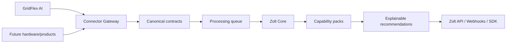

# Architecture

Zolt Core is product-neutral. Vendor mappings remain in connectors. Domain intelligence remains in capability packs. Physical execution is outside the platform.

## Applications

- `apps/api` — query, analysis, RBAC, credentials, webhooks, copilot
- `apps/connector-gateway` — signed GridFlex ingest
- `apps/worker` — persist telemetry, run skills, deliver webhooks
- `apps/console` — operator UI

## Data integrity

Composite foreign keys bind installations to `(productId, tenantId)`; bind telemetry, recommendations and credentials to `(installationId, tenantId, productId)`; and bind membership roles, sessions and installation access to `(tenantId,userId)`. Status fields use PostgreSQL enums. See `TENANCY.md` and `TELEMETRY_SCHEMA.md`.
