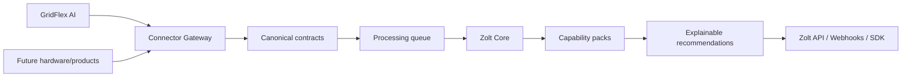

# Architecture

```mermaid
flowchart LR
  GF[GridFlex AI] --> GW[Connector Gateway]
  HW[Future hardware/products] --> GW
  GW --> C[Canonical contracts]
  C --> Q[Processing queue]
  Q --> CORE[Zolt Core]
  CORE --> PACKS[Capability packs]
  PACKS --> REC[Explainable recommendations]
  REC --> API[Zolt API / Webhooks / SDK]
```

Zolt Core is product-neutral. Vendor mappings remain in connectors. Domain intelligence remains in capability packs. Physical execution is outside the platform.
